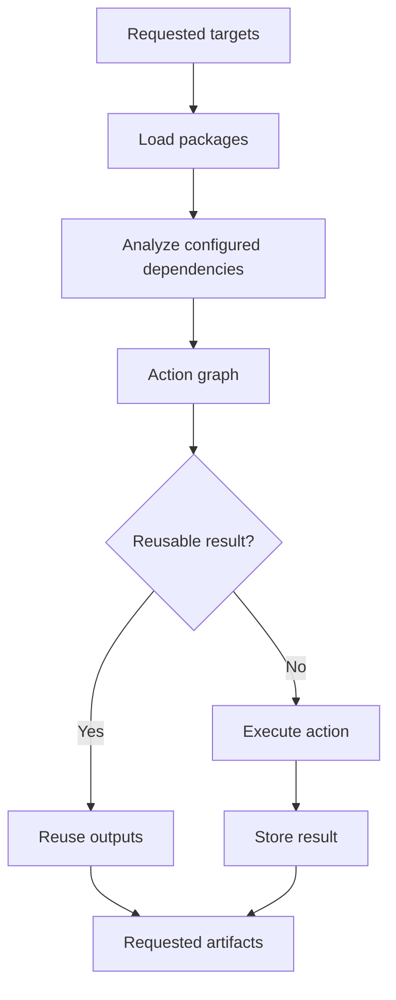

# Bazel: From Fundamentals to CI/CD

A practical reference for software, DevOps, platform, and build engineers.

Learn how Bazel describes dependencies, builds software, runs tests, reuses results, and fits into a delivery pipeline. Includes a complete C++ learning project, configuration examples, Jenkins integration, troubleshooting, and practice exercises.

> **Scope:** A broad learning guide, not an exhaustive replacement for every language ruleset's API documentation. Examples use modern Bzlmod dependency management. Shell commands assume Linux/Bash unless stated otherwise. Example versions are fixed learning pins, not claims about the latest release. The snippets were reviewed against documentation but were not executed with Bazel in the authoring environment.

## Contents

1. [What Bazel does](#1-what-bazel-does)
2. [Where Bazel fits](#2-where-bazel-fits)
3. [Core terminology](#3-core-terminology)
4. [How a build works](#4-how-a-build-works)
5. [Install and pin Bazel](#5-install-and-pin-bazel)
6. [Complete hands-on project](#6-complete-hands-on-project)
7. [BUILD files and dependencies](#7-build-files-and-dependencies)
8. [Command reference](#8-command-reference)
9. [Configuration with bazelrc](#9-configuration-with-bazelrc)
10. [Bzlmod and external dependencies](#10-bzlmod-and-external-dependencies)
11. [Tests and coverage](#11-tests-and-coverage)
12. [Queries and impact analysis](#12-queries-and-impact-analysis)
13. [Caching and remote execution](#13-caching-and-remote-execution)
14. [Sandboxing and reproducibility](#14-sandboxing-and-reproducibility)
15. [Platforms and toolchains](#15-platforms-and-toolchains)
16. [Starlark, macros, and rules](#16-starlark-macros-and-rules)
17. [Other languages and packaging](#17-other-languages-and-packaging)
18. [Jenkins pipeline](#18-jenkins-pipeline)
19. [Performance and observability](#19-performance-and-observability)
20. [Troubleshooting](#20-troubleshooting)
21. [Production practices](#21-production-practices)
22. [Interview questions](#22-interview-questions)
23. [Learning exercises](#23-learning-exercises)
24. [Official references](#24-official-references)

## 1. What Bazel does

Bazel is an open-source build and test system. You describe targets and their dependencies; Bazel determines the work needed to produce requested outputs.

For example, a C++ application may depend on two libraries. Bazel can compile independent source files concurrently, reuse valid outputs, and relink the application when a relevant library changes.

Its main strengths are incremental work, shared caching, explicit dependency graphs, and support for large, multi-language repositories through rulesets. Benefits depend on the quality of build definitions and toolchain configuration; adopting Bazel does not automatically make an arbitrary script reproducible.

**Useful distinction:** Bazel builds and tests software. Deployment, infrastructure provisioning, release approvals, and production monitoring still need their own workflows.

## 2. Where Bazel fits

| Tool | Main responsibility | Relationship to Bazel |
|---|---|---|
| Jenkins / GitHub Actions | Orchestrate jobs | Invoke Bazel and publish results |
| GCC / Clang / javac | Compile source | Used by language rules and toolchains |
| Make | Execute dependency-based recipes | Alternative build approach |
| CMake | Configure/generate native build systems | Alternative or integration point for existing C/C++ projects |
| Maven / Gradle | Build and dependency workflows, especially JVM | Alternatives; migration requires project-specific work |
| Docker | Build/run container images | Can package outputs or provide a build environment |
| Kubernetes | Run containerized workloads | Usually consumes images produced later in delivery |
| Terraform | Provision infrastructure | Can provision CI workers or cache infrastructure |
| Nexus / JFrog | Store artifacts and packages | Receive release outputs or host dependency sources |

**Good adoption candidates:** large dependency graphs, repeated CI builds, multiple languages, and teams that need consistent build behavior.

**Evaluate the cost first:** a tiny project may be simpler with its ecosystem's existing build tool. A migration also requires suitable rules, dependency modeling, and maintenance ownership.

For Android platform work, follow the specific branch's documented build entry points. Installing Bazel does not convert an AOSP Soong/Make build or make `bazel build //...` a replacement for that branch's build procedure.

## 3. Core terminology

| Term | Meaning | Example |
|---|---|---|
| Repository | Source tree with its own Bazel identity | Main project or external library |
| Workspace | Environment containing the main and external repositories | Your checked-out project plus resolved dependencies |
| Package | Directory with a `BUILD` or `BUILD.bazel` file; excludes nested packages | `app/` |
| Target | Named buildable object, rule instance, or file | `//app:hello` |
| Label | Address of a target | `//lib:greeting` |
| Rule | Definition of how a kind of target behaves | `cc_library` |
| Action | Execution step with declared inputs and outputs | Compile one `.cc` file |
| Artifact | Source or generated file in the graph | An object file or executable |
| Toolchain | Tools and configuration used by rules | Compiler, linker, associated settings |
| Runfiles | Files made available to a runnable target | Test fixtures and runtime resources |

### Labels and target patterns

| Expression | Meaning |
|---|---|
| `//app:hello` | Target `hello` in package `app` in the main repository |
| `:greeting` | Target in the current package, typically inside a BUILD file |
| `//:root_target` | Target in the repository-root package |
| `@rules_cc//cc:defs.bzl` | File in an external repository |
| `//app:all` | Rule targets in package `app` |
| `//app/...` | Recursive rule target pattern under `app` |
| `//...` | Recursive rule target pattern in the current repository |
| `//app:*` | All targets in the package, including file targets; quote in shells |

`//...` does not mean every target from every external dependency. Recursive patterns can also exclude targets through mechanisms such as `manual` tags or compatibility filtering.

## 4. How a build works

Bazel loads package definitions, analyzes requested targets under a configuration, creates an action graph, and executes work whose results cannot be reused.



A target is not necessarily one action. A library may require several compilation actions and an archive action. One source edit can invalidate only part of the graph; changing compiler flags or a widely used header can invalidate much more.

## 5. Install and pin Bazel

### Recommended launcher: Bazelisk

Bazelisk selects and downloads Bazel versions. Installing its binary as `bazel` lets you use the usual commands while keeping the version in the repository.

For Linux:

1. Download the binary for your CPU from [Bazelisk releases](https://github.com/bazelbuild/bazelisk/releases).
2. Check the release's verification information where provided.
3. Install the downloaded binary, for example on x86-64:

```bash
mkdir -p "$HOME/.local/bin"
install -m 0755 ./bazelisk-linux-amd64 "$HOME/.local/bin/bazel"
export PATH="$HOME/.local/bin:$PATH"
bazel --version
```

Add the `export PATH=...` line to `~/.bashrc` or `~/.zshrc` if needed. ARM64 requires the corresponding ARM64 binary. The first invocation needs download access unless the selected Bazel binary is already cached.

On macOS, Bazelisk can be installed with `brew install bazelisk`. On Windows, use the official Bazelisk installation instructions and the appropriate executable.

### Pin the version

Create `.bazelversion` in the repository root:

```text
8.2.1
```

This guide uses this fixed example baseline. For real projects, retain the repository's approved version and validate upgrades with its rulesets and toolchains. A directly installed Bazel executable does not use `.bazelversion` to switch versions; Bazelisk does.

### Linux prerequisites for the C++ exercise

```bash
sudo apt update
sudo apt install build-essential git ca-certificates unzip zip
```

Bazel's own Java runtime is distinct from the JDK used to compile Java applications. Installing a JDK is not a universal fix for every Bazel failure; check the relevant toolchain and error.

## 6. Complete hands-on project

Create a directory called `bazel-demo`. Add the following files at the listed relative paths. Commands in later sections assume this directory is your current working directory.

| File | Purpose |
|---|---|
| `.bazelversion` | Bazel version pin from section 5 |
| `MODULE.bazel` | Module metadata and C++ rules dependency |
| `lib/BUILD.bazel` | Library and test targets |
| `lib/greeting.h` | Public library interface |
| `lib/greeting.cc` | Implementation |
| `lib/greeting_test.cc` | Small standalone test |
| `app/BUILD.bazel` | Application target |
| `app/main.cc` | Application entry point |

### MODULE.bazel

```starlark
module(name = "bazel_demo", version = "0.1.0")

bazel_dep(name = "rules_cc", version = "0.1.1")
```

### lib/BUILD.bazel

```starlark
load("@rules_cc//cc:defs.bzl", "cc_library", "cc_test")

cc_library(
    name = "greeting",
    srcs = ["greeting.cc"],
    hdrs = ["greeting.h"],
    visibility = ["//app:__pkg__"],
)

cc_test(
    name = "greeting_test",
    srcs = ["greeting_test.cc"],
    deps = [":greeting"],
    size = "small",
)
```

### lib/greeting.h

```cpp
#ifndef BAZEL_DEMO_LIB_GREETING_H_
#define BAZEL_DEMO_LIB_GREETING_H_

#include <string>

std::string Greet(const std::string& name);

#endif
```

### lib/greeting.cc

```cpp
#include "lib/greeting.h"

std::string Greet(const std::string& name) {
    return "Hello, " + name + "!";
}
```

### lib/greeting_test.cc

```cpp
#include "lib/greeting.h"
#include <iostream>

int main() {
    if (Greet("Bazel") != "Hello, Bazel!") {
        std::cerr << "Greeting did not match expected output\n";
        return 1;
    }
    if (Greet("") != "Hello, !") {
        std::cerr << "Empty-name behavior changed\n";
        return 1;
    }
    return 0;
}
```

The test returns nonzero on failure. It deliberately does not use C++ `assert`, which can be disabled in optimized builds.

### app/BUILD.bazel

```starlark
load("@rules_cc//cc:defs.bzl", "cc_binary")

cc_binary(
    name = "hello",
    srcs = ["main.cc"],
    deps = ["//lib:greeting"],
)
```

### app/main.cc

```cpp
#include "lib/greeting.h"
#include <iostream>

int main(int argc, char** argv) {
    std::cout << Greet(argc > 1 ? argv[1] : "Bazel") << '\n';
    return 0;
}
```

### Build, run, and test

```bash
bazel build //app:hello
bazel run //app:hello -- Hemant
bazel test //lib:greeting_test --test_output=errors
bazel test //...
```

The application should print `Hello, Hemant!`. Bazel also prints its own progress messages.

Run the build again without edits, then change `lib/greeting.cc` and rebuild. Observe which actions are reused and which execute. If you change the expected greeting, update the tests intentionally.

### Generated outputs

```bash
bazel info bazel-bin
bazel info bazel-testlogs
bazel info output_base
bazel info execution_root
```

Common workspace convenience links include `bazel-bin`, `bazel-out`, and `bazel-testlogs`. Do not hardcode their underlying configuration-specific paths.

A starting `.gitignore`:

```gitignore
/bazel-*
/artifacts/
/profiles/
/.bazelrc.local
```

Commit source files, BUILD files, `.bazelversion`, `MODULE.bazel`, and the generated `MODULE.bazel.lock` when used by your workflow.

## 7. BUILD files and dependencies

BUILD files declare targets. `.bzl` files provide reusable definitions. Their syntax is Starlark, which resembles Python but is a separate language.

### Common attributes

| Attribute | Role |
|---|---|
| `name` | Target name within a package |
| `srcs` | Source files or source-producing targets |
| `hdrs` | Public headers for applicable C/C++ rules |
| `deps` | Dependencies consumed according to the rule's semantics |
| `data` | Runtime files and targets |
| `tools` | Build-time tools for rules that support it |
| `visibility` | Which packages may depend on a target |
| `testonly` | Restricts use to test-only consumers |
| `tags` | Metadata with some Bazel/ruleset-defined behaviors |

Not every attribute exists on every rule. Read the ruleset's reference before assuming support.

### Visibility

Use `//visibility:private` for internal targets, `//some/package:__pkg__` for one consumer package, and `//some/package:__subpackages__` for a package subtree. Use `//visibility:public` only for deliberate public interfaces.

Visibility controls dependency access; it is not a secret-management or filesystem security boundary.

### File selection

```starlark
filegroup(
    name = "fixtures",
    srcs = glob(["testdata/*.json"]),
)
```

`glob()` matches source files within package boundaries. It does not discover generated outputs. Explicit lists can make source changes clearer in reviews.

### Small generated-file example

Add to a package's BUILD file:

```starlark
genrule(
    name = "build_note",
    outs = ["build-note.txt"],
    cmd = "printf '%s\\n' 'Built with Bazel' > $@",
)
```

Use declared inputs and tools for real generation tasks. Avoid using a `genrule` as a wrapper around an entire opaque build system when you need fine-grained caching.

## 8. Command reference

General syntax:

```text
bazel [startup options] command [command options] [targets]
```

| Command | Purpose |
|---|---|
| `bazel build //app:hello` | Build an executable |
| `bazel run //app:hello -- Alice` | Build and run with application arguments |
| `bazel test //...` | Build and run matching tests |
| `bazel build //...` | Build matching rule targets, including test binaries |
| `bazel query //...` | Inspect targets without a configured build |
| `bazel fetch //...` | Fetch dependencies needed for matching targets |
| `bazel mod graph` | Inspect the Bazel module graph |
| `bazel info` | Show paths and environment information |
| `bazel version` | Show version details |
| `bazel help build` | Inspect build command options |
| `bazel shutdown` | Stop the workspace's Bazel server |
| `bazel clean` | Remove build outputs and reset relevant build state |
| `bazel clean --expunge` | Remove the output base; expensive last resort |

`bazel build` does not execute tests. `bazel clean` is not a prerequisite for an ordinary rebuild and does not mean every shared or remote cache was deleted.

## 9. Configuration with bazelrc

Add this `.bazelrc` to the sample repository:

```text
build --verbose_failures
test --test_output=errors

build:debug --compilation_mode=dbg
build:release --compilation_mode=opt

build:ci --color=no
build:ci --curses=no
build:ci --keep_going
test:ci --test_output=errors

try-import %workspace%/.bazelrc.local
```

Use it with:

```bash
bazel build --config=debug //app:hello
bazel build --config=release //app:hello
bazel test --config=ci //...
```

A configuration name such as `ci` or `release` is project-defined. It has no built-in deployment meaning. Build options also apply to commands that inherit build behavior, such as `test`.

Inspect active rc options:

```bash
bazel build --announce_rc //app:hello
```

Startup options precede the command:

```bash
bazel --output_base=/tmp/bazel-demo-isolated build //app:hello
```

Separate output bases can isolate concurrent builds, but duplicate state and consume disk.

### Conditional target attributes

Add in a C++ package:

```starlark
config_setting(
    name = "debug_mode",
    values = {"compilation_mode": "dbg"},
)
```

Then, inside a suitable `cc_binary` or `cc_library` declaration:

```starlark
local_defines = select({
    ":debug_mode": ["DEMO_DEBUG=1"],
    "//conditions:default": [],
}),
```

`select()` chooses attribute values during configuration analysis. It is not ordinary Python control flow and cannot be inspected as a resolved value by a loading-phase macro.

## 10. Bzlmod and external dependencies

Modern Bazel uses `MODULE.bazel` to declare Bazel module dependencies. A module can represent a ruleset, library, or tooling project.

```starlark
bazel_dep(name = "rules_cc", version = "0.1.1")
```

Bazel resolves transitive module dependencies. The declared version is a request in the module graph; another dependency can cause selection of a higher compatible version. Inspect the result with `bazel mod graph` rather than assuming each declaration is an isolated exact lock.

### Files and concepts

| Item | Purpose |
|---|---|
| `MODULE.bazel` | Direct module requirements and extension configuration |
| `MODULE.bazel.lock` | Records resolution-related data, including registry and extension information |
| Bazel Central Registry | Default public registry of Bazel modules |
| `use_extension()` | Use a module extension, for example a package-manager integration |
| `use_repo()` | Make extension-generated repositories visible to the calling module |
| `use_repo_rule()` | Instantiate a repository rule from MODULE.bazel |
| Root-module overrides | Replace or redirect dependencies for controlled cases |

Language package locks remain relevant: the Bazel lockfile does not automatically replace every pip, Maven, or npm lock and resolver configuration.

### Legacy WORKSPACE projects

The old system used `WORKSPACE` / `WORKSPACE.bazel` and repository setup macros. It is disabled by default in Bazel 8 and removed in Bazel 9. Follow the migration guide when upgrading an older repository; do not paste old WORKSPACE snippets into MODULE.bazel unchanged.

For migration: inventory dependencies, find Bzlmod-compatible rulesets, translate repository setup, resolve module names/visibility, and validate representative targets before switching the full CI pipeline.

## 11. Tests and coverage

Use independent tests with declared fixtures. Avoid hidden dependencies on the developer's current directory, home directory, or manually running services.

```bash
# One test; print failure output
bazel test //lib:greeting_test --test_output=errors

# Force a new execution instead of using cached test results
bazel test //lib:greeting_test --nocache_test_results

# Repeated runs to investigate flakiness
bazel test //lib:greeting_test --runs_per_test=10

# Show all test output
bazel test //lib:greeting_test --test_output=all
```

Test filters and arguments are framework-specific. `--test_filter` is passed to supported test runners; it is not a universal test-language query.

Test logs and XML results are normally under `bazel-testlogs/<package>/<target>/`. Runtime resources should be declared in `data` and located through the language's runfiles support when needed.

### Coverage

```bash
bazel coverage //... --combined_report=lcov
bazel info output_path
```

With supported rules and coverage tools, a combined report is typically under `_coverage/_coverage_report.dat` in the output directory. Coverage support depends on the language, toolchain, and execution setup. LCOV is a report format; generating an HTML viewer is a separate step.

## 12. Queries and impact analysis

### query: target dependency graph

```bash
bazel query '//...'
bazel query 'deps(//app:hello)'
bazel query 'rdeps(//..., //lib:greeting)'
bazel query 'somepath(//app:hello, //lib:greeting)'
bazel query 'kind(".*_test rule", //...)'
bazel query 'tests(//...)'
bazel query 'deps(//app:hello)' --output=graph > dependency-graph.dot
```

`deps()` follows dependencies; `rdeps()` finds reverse dependencies inside the specified universe. Quote expressions so the shell does not interpret parentheses or wildcard characters.

### cquery: configured targets

```bash
bazel cquery 'deps(//app:hello)' --config=release
bazel cquery //app:hello --output=files
```

Use `cquery` when platform selection, `select()`, or transitions affect the answer. Ordinary `query` can include alternatives that a specific configured build would not select.

### aquery: actions

```bash
bazel aquery 'mnemonic("CppCompile", deps(//app:hello))'
```

Use `aquery` to inspect compile/link actions, inputs, outputs, and command lines. It helps explain what Bazel intends to execute.

**Changed-target CI caveat:** reverse dependency queries are useful building blocks, not a complete impact-analysis algorithm. Deleted files, BUILD changes, toolchain updates, flags, and dependencies can affect targets beyond a naive changed-file query. Retain broader validation while developing selective CI.

## 13. Caching and remote execution

| Mechanism | What it reuses or provides |
|---|---|
| Existing local output state | Valid results already available for the workspace |
| Disk action cache | Reusable action results in a configured local directory |
| Repository cache | Downloaded external dependency content |
| Remote action cache | Action results shared through a cache service |
| Remote execution | Workers execute eligible actions away from the local machine |

### Local disk cache

```bash
bazel build //... --disk_cache="$HOME/.cache/bazel-action-cache"
```

### Remote cache template

The following endpoint is a placeholder. Use a real, compatible, authenticated service:

```text
build:remote --remote_cache=grpcs://cache.example.com
```

```bash
bazel build --config=remote //...

# Read shared results without uploading locally produced results
bazel build --config=remote --remote_upload_local_results=false //...
```

A cache typically stores action-result metadata and content-addressed output blobs. Inputs, command lines, relevant environment, and configuration influence action reuse. It does not simply compare Git commit IDs.

Restrict cache writes to trusted builders. Keep credentials in CI secret facilities or approved local credential configuration, not a committed `.bazelrc`. Artifact repositories are not automatically Bazel remote caches merely because they store files.

### Remote execution template

```text
build:remote-exec --remote_executor=grpcs://executor.example.com
```

This requires an actual execution service, suitable execution platforms/toolchains, and service-specific authentication. A remote cache alone does not run compilation. Remote workers must be able to execute declared tools with the required platform properties.

## 14. Sandboxing and reproducibility

Sandboxing gives actions an isolated execution directory containing their declared inputs. This catches many dependencies on undeclared files and improves confidence in cached results.

It is not a complete security boundary for arbitrary hostile code, nor a guarantee that all host files or networks are inaccessible on every platform.

```bash
bazel build //app:hello --verbose_failures --sandbox_debug
```

Debug the first failing action. A missing file often belongs in `srcs`, `deps`, `data`, or a declared tool dependency. Avoid making permanent local-execution exceptions just to hide undeclared dependencies.

For reproducibility, pin the Bazel version, rules, external packages, and toolchains; declare inputs; control meaningful environment variables; and avoid timestamps or random values in ordinary outputs. A sandboxed action can still depend on machine-specific tools if the toolchain is not controlled.

## 15. Platforms and toolchains

| Platform concept | Meaning |
|---|---|
| Host | Machine running Bazel |
| Execution | Machine on which a build action executes |
| Target | Machine/environment the resulting software is intended for |

These can differ. For example, Bazel can run on an x86-64 Linux host, execute compilation on Linux workers, and produce ARM64 binaries.

A platform describes constraints such as operating system and CPU. A toolchain supplies compatible tools and settings. Rules request toolchain types; Bazel resolves suitable registered toolchains.

```bash
# Template: this target must exist, with suitable toolchains registered
bazel build //app:hello --platforms=//platforms:linux_arm64
```

A platform label does not install a cross-compiler. Cross-compilation requires a compiler, sysroot, libraries, and rule support for the target environment. The sample project initially uses a locally detected C++ toolchain, so it is not a fully hermetic cross-platform setup.

## 16. Starlark, macros, and rules

### Starlark basics

Starlark is used to describe builds and extend Bazel. Use `load()` to import exported symbols from `.bzl` files. Do not assume ordinary Python imports, libraries, or unrestricted filesystem/network access are available.

### Macro versus rule

| Concept | Responsibility |
|---|---|
| Macro | Creates targets from reusable declarations |
| Rule | Analyzes attributes/dependencies and registers actions/providers |
| Provider | Structured information passed between targets |
| Aspect | Adds analysis along dependency edges, often for tooling |
| Repository rule | Obtains or generates an external repository |
| Module extension | Coordinates repository creation in the module system |

Bazel 8 introduced symbolic macros. Prefer learning their API for new reusable macro libraries; existing repositories may still use legacy function-based macros.

### A tiny custom rule

Create `tools/BUILD.bazel`:

```starlark
exports_files(["note.bzl"])
```

Create `tools/note.bzl`:

```starlark
def _note_impl(ctx):
    output = ctx.actions.declare_file(ctx.label.name + ".txt")
    ctx.actions.write(
        output = output,
        content = ctx.attr.message + "\n",
    )
    return [DefaultInfo(files = depset([output]))]

note = rule(
    implementation = _note_impl,
    attrs = {
        "message": attr.string(mandatory = True),
    },
)
```

Create a root `BUILD.bazel`:

```starlark
load("//tools:note.bzl", "note")

note(
    name = "welcome",
    message = "Learning Bazel build rules",
)
```

```bash
bazel build //:welcome
```

The rule declares an output and registers a write action. It exposes the output using `DefaultInfo`. Real language rules also handle toolchains, runtime files, and language-specific providers.

## 17. Other languages and packaging

Use maintained rulesets and their version-specific setup documentation. Do not assume language rules shown as built-ins in older tutorials remain available without explicit loads.

| Need | Common starting point |
|---|---|
| C / C++ | `rules_cc` |
| Python | `rules_python` |
| Java | `rules_java`; often `rules_jvm_external` for Maven dependencies |
| Go | `rules_go`; commonly Gazelle for BUILD generation |
| Rust | `rules_rust` |
| JavaScript / TypeScript | Ecosystem rules such as `rules_js` and `rules_ts` |
| Protocol Buffers | Language-specific protobuf rules and toolchains |
| Tar / zip / installation packages | `rules_pkg` |
| OCI images | `rules_oci` or another maintained image ruleset |

For Python, expect to configure both a Python toolchain and third-party package resolution. A conceptual target layout is `py_library` for reusable code, `py_binary` for an entry point, and `py_test` for tests. Merely adding `deps = ["requests"]` does not install a pip package.

Packaging is explicit: `bazel build` produces the outputs of the targets you defined. It does not automatically create a Docker image, upload to Nexus, or deploy to Kubernetes.

## 18. Jenkins pipeline

This example builds the C++ sample, stages the executable, runs tests, and publishes available reports. It assumes Jenkins Pipeline and JUnit support, a Linux agent with Bazelisk installed as `bazel`, and the repository's `.bazelrc` from section 9.

```groovy
pipeline {
    agent { label 'linux-bazel' }

    options {
        timestamps()
        disableConcurrentBuilds()
        skipDefaultCheckout(true)
        timeout(time: 30, unit: 'MINUTES')
    }

    stages {
        stage('Checkout') {
            steps {
                checkout scm
            }
        }

        stage('Build') {
            steps {
                sh '''
                    set -eu
                    bazel --version
                    bazel build --config=ci //app:hello
                    mkdir -p artifacts
                    cp "$(bazel info bazel-bin)/app/hello" artifacts/hello
                '''
            }
        }

        stage('Test') {
            steps {
                sh '''
                    set -eu
                    bazel test --config=ci //...
                '''
            }
            post {
                always {
                    sh '''
                        set -eu
                        report_root="$(bazel info bazel-testlogs)"
                        mkdir -p artifacts/test-results
                        if [ -d "$report_root" ]; then
                            cp -RL "$report_root"/. artifacts/test-results/
                        fi
                    '''
                    junit testResults: 'artifacts/test-results/**/test.xml',
                          allowEmptyResults: true
                }
            }
        }
    }

    post {
        always {
            archiveArtifacts artifacts: 'artifacts/**',
                             allowEmptyArchive: true,
                             fingerprint: true
        }
    }
}
```

Change the Jenkins label to an existing agent label. The report copy follows Bazel's convenience links so Jenkins reads ordinary staged files. `allowEmptyResults` allows reporting to proceed if compilation failed before test XML was produced; the failing shell step still fails the pipeline. Once a project expects tests reliably, add a separate policy to detect accidentally missing reports.

Use fresh workspaces or remove only the job-owned `artifacts/` directory at job start to avoid publishing stale files on reused workspaces. Do not run `bazel clean` in every build. For several jobs, prefer separate workspaces/output bases with a shared disk or remote cache.

The `post` block can archive binaries from a failed test run for investigation. Promote or upload release artifacts only in a success-gated release stage. Store Nexus credentials in Jenkins Credentials and keep publishing separate from deterministic build actions.

## 19. Performance and observability

Measure before tuning. Separate cold builds, warm builds, no-op rebuilds, and builds after a representative change.

```bash
mkdir -p profiles
bazel build //app:hello --profile=profiles/build.json.gz
bazel analyze-profile profiles/build.json.gz

bazel test //... --build_event_json_file=profiles/test-events.json
```

The trace profile helps inspect loading, analysis, execution, and the critical path. Build Event Protocol data is useful for CI dashboards and detailed build/test reporting; it is separate from the execution trace.

Practical tuning sequence:

1. Check the slowest actions and whether they can run concurrently.
2. Investigate avoidable cache misses caused by flags, environment, or tool differences.
3. Split unnecessarily large targets where it helps dependency granularity.
4. Limit concurrency if the machine is memory-bound: try `--jobs=4` and measure.
5. Evaluate shared caches or remote execution when infrastructure overhead is justified.

A fast local rebuild does not prove a fresh CI agent will be fast. Cache-hit percentages alone can also mislead: one missed expensive link action may dominate the build.

## 20. Troubleshooting

| Symptom | Check | Next step |
|---|---|---|
| `bazel: command not found` | Installation location and `PATH` | Check `command -v bazel` and shell configuration |
| Unexpected Bazel version | Launcher, `.bazelversion`, overrides | Compare `command -v bazel` and `bazel --version` |
| No package / missing BUILD file | Correct directory and package boundary | Use `bazel query '//...'` |
| No such target | Target name and package | Query the exact package |
| Visibility error | Consumer access to dependency | Grant the smallest intended visibility |
| Unknown language rule | Missing ruleset or `load()` | Follow that ruleset's setup for the pinned release |
| Header or source unavailable | Declared sources and dependencies | Inspect the failed compile action |
| Works outside the sandbox only | Hidden files/tools/environment | Declare the dependency; reproduce with sandbox debug |
| Module resolution failure | Versions, names, registry connectivity | Inspect `bazel mod graph` and first resolution error |
| Downloads fail behind a proxy | Proxy, certificates, hostname, authentication | Configure approved trust/proxy settings; do not disable TLS verification |
| No matching toolchain | Registered toolchains and constraints | Check target/execution platform compatibility |
| Unexpected test cache reuse | Test inputs/environment and flags | Use `--nocache_test_results` while investigating |
| Local success, CI failure | Toolchains, permissions, working directory | Compare configs and inspect declared inputs |
| Memory pressure or killed compiler | Kernel/container limits and job concurrency | Lower jobs and identify the memory-heavy action |
| Poor cache reuse | Flags, tools, environment, nondeterministic outputs | Compare action details and profiles |
| Disk usage is high | Output bases, caches, retained debug sandboxes | Apply a deliberate retention policy |
| Workspace appears locked | Another Bazel command on the same output base | Let it finish or stop the owning job cleanly |

Useful diagnostic command:

```bash
bazel build //app:hello --verbose_failures --subcommands --sandbox_debug
```

Logs may contain paths, arguments, or environment details; review before sharing externally. Cleaning is a diagnostic last step, not a substitute for understanding the failure.

## 21. Production practices

- Keep version pins and lock changes reviewable.
- Define reusable libraries with narrow dependencies and visibility.
- Treat rules and fetched build tools as executable dependencies requiring review.
- Use trusted cache writers and protect release credentials.
- Keep build/test work distinct from publishing and deployment side effects.
- Preserve logs and profiles when investigating regressions.
- Avoid absolute developer-machine paths in BUILD files.
- Validate upgrades across representative targets and supported platforms.
- Start migrations with a small vertical slice: library, binary, test, CI, artifact.
- Document exceptions, such as tests requiring network services, explicitly.

## 22. Interview questions

**Why can Bazel rebuild faster after a small edit?**  
It tracks dependencies and action inputs, so unaffected work can be reused while invalidated actions run again.

**What is the difference between a target and an action?**  
A target is a named build entity. Its analysis can register several actions, such as compilation and linking.

**Does Bazel replace Jenkins?**  
No. Jenkins orchestrates the pipeline; Bazel handles build and test work inside it.

**Does a remote cache compile code?**  
No. It stores reusable results. Remote execution runs actions on workers.

**What makes a build hermetic?**  
Its results depend on declared, controlled inputs and tools instead of hidden machine state.

**Why might `query` and `cquery` differ?**  
`query` inspects the unconfigured dependency graph; `cquery` accounts for a chosen configuration.

**Is every Bazel build automatically reproducible?**  
No. Undeclared inputs, uncontrolled tools, timestamps, and environment-dependent behavior can still break reproducibility.

**Why avoid cleaning on every CI run?**  
It discards useful state and increases repeated work. Use isolation and managed caches deliberately.

## 23. Learning exercises

| Exercise | Evidence that you understand it |
|---|---|
| Build and run the sample | Explain the target label and output location |
| Introduce a greeting bug | Observe a failing test and locate its log |
| Change only `app/main.cc` | Explain which compilation work should be unaffected |
| Remove the application's `deps` entry | Explain why including a header is not a replacement for a declared dependency |
| Restrict library visibility | Explain a dependency-access error |
| Run dependency queries | Identify what depends on the greeting library |
| Add the custom `note` rule | Explain declared output, action, and provider |
| Compare debug and release builds | Explain configuration-dependent outputs |
| Run Jenkins on a fresh agent | Identify download, build, test, and reporting requirements |
| Profile cold and warm builds | Explain which part improved and why |

## 24. Official references

Use documentation matching the Bazel and ruleset versions in your repository. The following are primary documentation and upstream project entry points, consulted for this guide on 3 October 2026.

- [Bazel overview](https://bazel.build/)
- [Bazelisk installation](https://bazel.build/install/bazelisk)
- [Bazelisk upstream README and releases](https://github.com/bazelbuild/bazelisk)
- [Repositories, workspaces, packages, and targets](https://bazel.build/concepts/build-ref)
- [C++ tutorial](https://bazel.build/start/cpp)
- [Build programs](https://bazel.build/run/build)
- [Commands and options](https://bazel.build/docs/user-manual)
- [Common rule definitions](https://bazel.build/reference/be/common-definitions)
- [General rules](https://bazel.build/reference/be/general)
- [bazelrc configuration](https://bazel.build/run/bazelrc)
- [External dependencies](https://bazel.build/external/overview)
- [Bzlmod migration](https://bazel.build/external/migration)
- [Bazel Central Registry](https://registry.bazel.build/)
- [Configurable attributes](https://bazel.build/configure/attributes)
- [Coverage](https://bazel.build/configure/coverage)
- [Query guide](https://bazel.build/query/guide)
- [Configured queries](https://bazel.build/query/cquery)
- [Action queries](https://bazel.build/query/aquery)
- [Remote caching](https://bazel.build/remote/caching)
- [Remote execution](https://bazel.build/remote/rbe)
- [Sandboxing](https://bazel.build/docs/sandboxing)
- [Platforms](https://bazel.build/concepts/platforms)
- [Writing rules](https://bazel.build/extending/rules)
- [Macros](https://bazel.build/extending/macros)
- [Trace profiles](https://bazel.build/advanced/performance/json-trace-profile)
- [C++ rules](https://github.com/bazelbuild/rules_cc)
- [Python rules](https://github.com/bazel-contrib/rules_python)
- [Buildtools: Buildifier and related tools](https://github.com/bazelbuild/buildtools)
